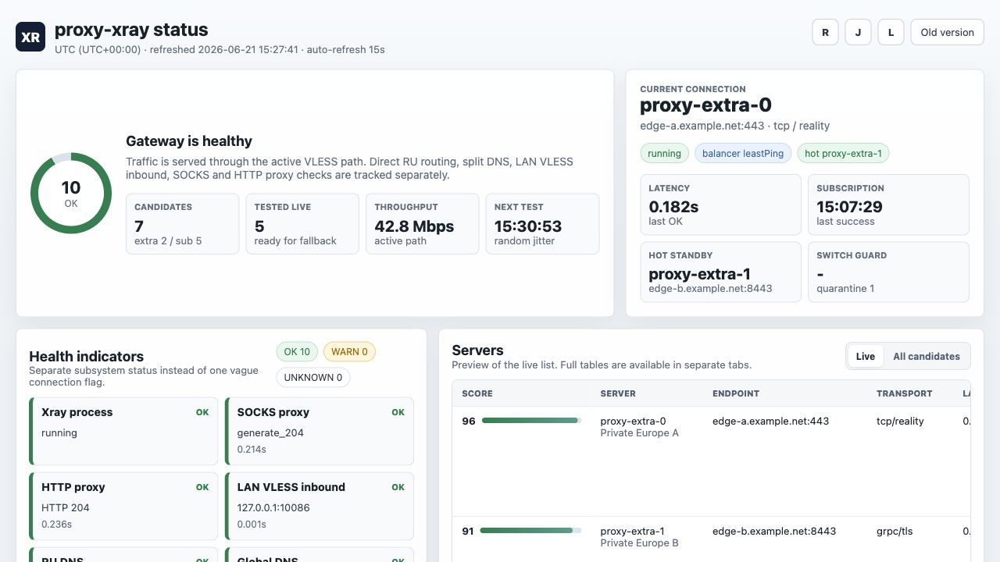
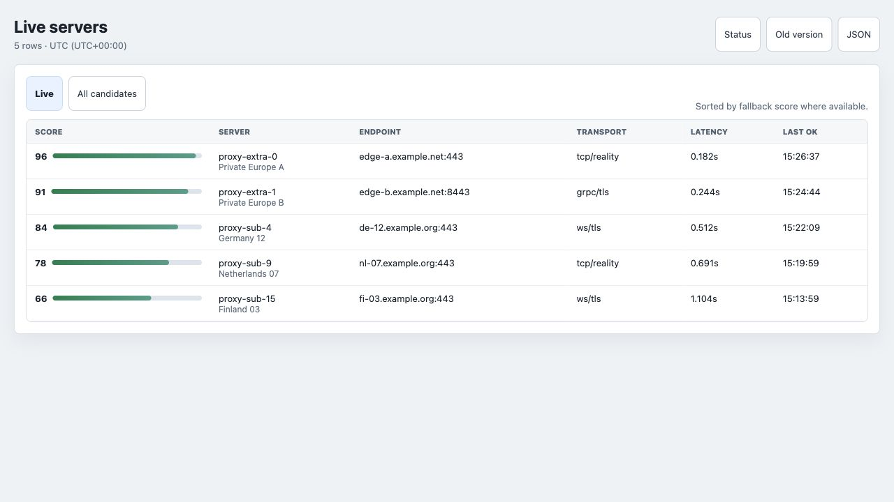

# proxy-xray

Dockerized Xray gateway for a home LAN.

The project runs Xray-Core behind stable local ports and supervises a pool of VLESS servers from a subscription plus an optional private server list. It keeps a hot standby connection ready, checks degradation, switches away from bad paths, exposes a simple status page, and routes Russian domains/IP ranges directly.

## What It Provides

- SOCKS proxy on `1080`.
- HTTP proxy on `8123`.
- Optional plain LAN VLESS inbound on `10086`.
- Local status UI on `18080`.
- VLESS subscription refresh every two hours by default.
- Extra private VLESS links from `vless-extra.txt`.
- Two active Xray slots: current path plus hot standby.
- Liveness, latency, small quality download, throughput, and random candidate checks.
- RU split DNS and direct routing for `.ru`, `.su`, `.рф`, `geosite:category-ru`, and `geoip:ru`.
- LoyalSoldier `geoip.dat` / `geosite.dat` asset management.
- Telegram notification after successful failover recovery.
- SSH deploy script for a home server.

## Repository Safety

Real connection data is intentionally not tracked.

Ignored local files:

- `.env` - subscription URL, Telegram token/chat id, LAN VLESS UUID.
- `vless-extra.txt` - private VLESS links.
- `state.json` - cached subscription candidates and measured server state.
- `vless-lan-qr.png` - local QR code.
- `assets/` - downloaded geo assets.

Use the example files as templates:

```shell
cp .env.example .env
cp vless-extra.example.txt vless-extra.txt
cp state.example.json state.json
mkdir -p assets
```

Then edit `.env` and `vless-extra.txt`.

## Configuration

`.env`:

```shell
# VLESS subscription URL from your provider.
XRAY_SUB_URL=https://example.com/subscription

# UUID for local LAN clients connecting to this gateway on port 10086.
# Generate once with: python3 -c 'import uuid; print(uuid.uuid4())'
# Use the same value in V2RayTun / VLESS client config.
INBOUND_VLESS_ID=00000000-0000-0000-0000-000000000000

# Optional Telegram notification settings.
# TELEGRAM_BOT_TOKEN: create a bot with @BotFather and copy its HTTP API token.
# TELEGRAM_CHAT_ID: send any message to the bot, then run:
# curl "https://api.telegram.org/bot<TELEGRAM_BOT_TOKEN>/getUpdates"
# Use message.chat.id from the response.
TELEGRAM_BOT_TOKEN=
TELEGRAM_CHAT_ID=

TZ=Europe/Moscow
```

`INBOUND_VLESS_ID` is not issued by the subscription provider. It is your own local client UUID for the inbound VLESS listener on the home gateway. Generate it once, keep it in `.env`, and use the same UUID when creating the LAN VLESS client profile.

Telegram notifications are optional. Create a bot through `@BotFather`, put the returned API token into `TELEGRAM_BOT_TOKEN`, send any message to that bot from your Telegram account, then call `getUpdates` and copy `message.chat.id` into `TELEGRAM_CHAT_ID`.

`vless-extra.txt` contains one private VLESS URI per line. These servers are not refreshed from the subscription and are sampled more often by the candidate checker.

## Run Locally

```shell
docker compose build proxy-xray
docker compose up -d --force-recreate
```

Check status:

```shell
curl http://127.0.0.1:18080/json
docker logs proxy-xray --tail 80
```

Open the UI:

```text
http://127.0.0.1:18080/
```

## Ports

| Port | Purpose |
| --- | --- |
| `1080/tcp` | SOCKS proxy |
| `1080/udp` | SOCKS UDP |
| `8123/tcp` | HTTP proxy |
| `10086/tcp` | LAN VLESS inbound |
| `18080/tcp` | Status web UI |

The DNS relay exists inside the container, but compose does not publish port `53` by default.

## LAN VLESS Client

When `--inbound-vless` is enabled, LAN clients can use:

```text
vless://INBOUND_VLESS_ID@HOME_SERVER_IP:10086?security=none&type=tcp#home-proxy
```

Replace:

- `INBOUND_VLESS_ID` with your generated value from `.env`;
- `HOME_SERVER_IP` with the Docker host LAN IP.

## How Failover Works

The supervisor starts two Xray instances:

- active slot: receives public `1080`, `8123`, and `10086` through a local TCP switch and runs a small Xray balancer pool;
- standby slot: already running with a separate hot standby balancer pool and checked in the background.

The default compose uses:

- active pool: `3` candidates;
- standby pool: `3` candidates.
- extra reserve: `1` live private extra URI per active/standby slot when available;
- hot standby fast switch: `1` full active-path failure when standby is already healthy.
- liveness check: every `20` seconds, failover after `2` failures;
- quality download: every `60` seconds, 512 KB, failover after `2` slow checks;
- heavy throughput: every `300` seconds, used as a quality metric by default.

Each slot has a score-ordered pool. Xray can choose between several outbounds inside the slot, and the first outbound remains the native Xray fallback if observatory cannot choose one.

Failover can be triggered by:

- repeated health-check failures;
- repeated high latency;
- repeated low quality-download speed;
- unhealthy current slot with a healthy hot standby available.

On successful switch:

1. Public ports are pointed to the standby slot.
2. The previous active pool head is soft-quarantined.
3. A new standby is built.
4. `state.json` is updated.
5. Telegram notification is sent if configured.

Candidate checks are intentionally sequential. One random candidate is tested every 2-5 minutes by default, with extra-list servers weighted higher. This avoids hammering a subscription with many concurrent VLESS connections.

At startup the active slot must pass a preflight health check before public ports are attached to it. If the first outbound in the pool is dead, it is soft-quarantined and another pool is tried.

## State File

`state.json` uses schema v2 and stores candidate cache plus a bounded quality history:

- last OK/fail timestamps;
- last latency and throughput;
- last `50` recent checks per candidate;
- rolling success rate, failure streak, latency EWMA, and throughput EWMA.

The file is written atomically. If it is corrupted, startup moves it to `state.json.corrupt.<timestamp>` and continues with an empty state instead of crashing.

## Routing And DNS

The default compose routes Russian resources directly:

- `geosite:category-ru`
- `regexp:.*\.ru$`
- `regexp:.*\.su$`
- `regexp:.*\.xn--p1ai$`
- `geoip:ru`

Split DNS is enabled:

- RU domains use `77.88.8.8,77.88.8.1`;
- other domains use `8.8.8.8,1.1.1.1`;
- upstream DNS is queried directly, not through Xray.

Xray sniffing is enabled on SOCKS, HTTP, and LAN VLESS inbounds with `routeOnly`, so TLS SNI / HTTP Host can be used for routing without rewriting the destination.

## Geo Assets

LoyalSoldier assets are stored in `./assets`:

- `geoip.dat`
- `geosite.dat`
- `assets-state.json`

The image seeds bundled assets. Runtime refresh happens on schedule, but compose uses `--no-asset-refresh-on-start` so a slow GitHub download does not block container startup.

## Status UI

Available endpoints:

- `/` - HTML dashboard.
- `/client` - LAN VLESS connection string and QR code.
- `/servers/live` - tested live servers.
- `/servers/all` - all candidates.
- `/json` - machine-readable status.
- `/diagnostics` - live direct/SOCKS/HTTP URL probes and DNS probes.
- `/diagnostics.json` - machine-readable sanitized diagnostic output.
- `/diagnostics/bundle` - downloadable sanitized diagnostic JSON.
- `/logs` - recent supervisor logs.

The screenshots below use synthetic demo data. Server names, endpoints, IDs, and operational details are not real.

The `/client` page builds the VLESS client URL from the address used to open the status UI. Open the UI through the server LAN address, for example `http://192.168.2.200:18080/`, before scanning the QR code from another device.





The dashboard shows:

- health indicators;
- current connection;
- hot standby;
- active path selected by Xray balancer API;
- active and standby observatory snapshots in `/json`;
- candidate scores;
- throughput;
- subscription state;
- geo asset state;
- diagnostic probe entry point;
- recent logs.

## Deploy To A Home Server

The deploy script syncs files over SSH, preserves server runtime state, rebuilds the image, and recreates the container.

```shell
DEPLOY_HOST=192.168.1.10 \
DEPLOY_USER=user \
DEPLOY_PATH=/home/user/proxy-xray \
scripts/deploy-server.sh
```

By default it copies local `.env` and `vless-extra.txt`, but keeps server-side `state.json` and `assets/`.

See [DEPLOY.md](DEPLOY.md) for options.

## Smoke Tests

Run the client smoke container:

```shell
docker compose -f docker-compose.yml -f docker-compose.test.yml run --rm proxy-client-test
```

It checks:

- status UI;
- SOCKS proxy;
- HTTP proxy;
- LAN VLESS inbound;
- basic throughput;
- small quality download status;
- split DNS behavior;
- RU direct-routing smoke access;
- bundled LoyalSoldier assets.

## Useful Commands

Rebuild and restart:

```shell
docker compose build proxy-xray
docker compose up -d --force-recreate
```

Watch logs:

```shell
docker logs -f proxy-xray
```

Check current public HTTP proxy:

```shell
curl -x http://127.0.0.1:8123 https://www.gstatic.com/generate_204 -i
```

Check SOCKS:

```shell
curl -x socks5h://127.0.0.1:1080 https://checkip.amazonaws.com
```

## Credits

This project started from the original `samuelhbne/proxy-xray` Docker wrapper for Xray-Core, then grew into a subscription supervisor and home LAN gateway with hot standby failover, split DNS, status UI, and deployment tooling.
