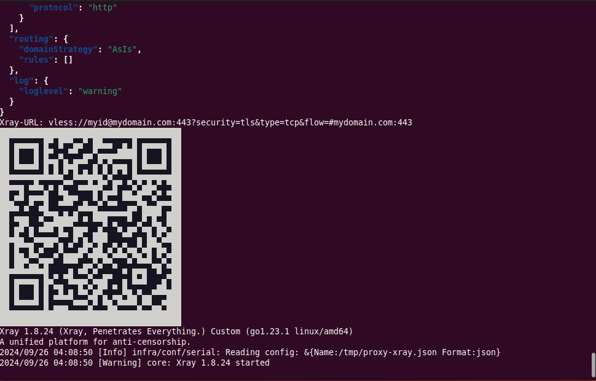

# proxy-xray

[Xray-Core](https://github.com/XTLS/Xray-core) is a low detectable VPN. proxy-xray is a Xray-Core client container that runs Xray-Core with config file generated from command line options automatically hence remove the necessity of config file modification.

Please have a look over the sibling project [server-xray](https://github.com/samuelhbne/server-xray) if you'd like to setup a Xray-Core server first.


## Quick start

The following command will create a VLESS-TCP-TLS-XTLS client connecting to mydomain.com  port 443 with given uid. Expose Socks-proxy port 1080 as a local service.

```shell
$ docker run --rm -it -p 1080:1080 samuelhbne/proxy-xray --lttx myid@mydomain.com:443
...
```

The following command will create a VLESS-SplitHTTP-TLS-HTTP3 client connecting to mydomain.com port 443 with given uid and webpath. Expose Socks-proxy port 1080 as a local service.

```shell
$ docker run --rm -it -p 1080:1080 samuelhbne/proxy-xray --lst3 myid@mydomain.com:443:/split0
...
```

The following command will create a VLESS-TCP-REALITY-XTLS client connecting to mydomain.com port 443 with given uid, applying yahoo.com as fake destnation, applying public key from "pub" parameter, exposing Socks-proxy port 1080, http-proxy port 8123, DNS port 53 as local services. Websites and IP located in China will not be proxied. China-accessible domains will be resolved to local hence to accelerate the local domain access.

```shell
$ docker run --rm -it -p 1080:1080 -p 1080:1080/udp -p 8123:8123 -p 53:53/udp \
--name proxy-xray samuelhbne/proxy-xray --cn-direct --dns-local-cn \
--ltrx myid@mydomain.com:443,d=yahoo.com,pub=qAaJnTE_zYWNuXuIdlpIfSt5beveuV4PyBaP76WE7jU
...
```

** NOTE **

Name query for sites outside China like twitter.com will be always forwarded to designated DNS (1.1.1.1 by default) to avoid contaminated results. Name query for sites inside China like apple.com.cn will be forwarded to local DNS servers in China to avoid cross region slow access when "--dns-local-cn" options applied. Otherwise all queries will be forwarded to designated DNS server.

## How to verify if proxy tunnel is working properly

```shell
$ curl -sSx socks5h://127.0.0.1:1080 https://checkip.amazonaws.com
12.34.56.78

$ curl -sSx http://127.0.0.1:8123 https://checkip.amazonaws.com
12.34.56.78

$ dig +short @127.0.0.1 -p 53 twitter.com
104.244.42.193
104.244.42.129

$ docker exec proxy-xray proxychains whois 104.244.42.193|grep OrgId
[proxychains] config file found: /etc/proxychains/proxychains.conf
[proxychains] preloading /usr/lib/libproxychains4.so
[proxychains] DLL init: proxychains-ng 4.14
[proxychains] Strict chain  ...  127.0.0.1:1080  ...  whois.arin.net:43  ...  OK
OrgId:          TWITT
```

** NOTE **

- curl should return the Xray server address given above if SOCKS5/HTTP proxy works properly.
- dig should return resolved IP recorders of twitter.com if DNS server works properly.
- Whois should return "OrgId: TWITT". That means the IP address returned from dig query belongs to twitter.com indeed, hence untaminated.
- Whois was actually running inside the proxy container through the proxy tunnel to avoid potential access blocking.

## How to get the XRay QR code for mobile connection

proxy-xray always display the QR code after the successful config file generation.

```shell
$ docker run --name proxy-xray --rm -it -p 1080:1080 samuelhbne/proxy-xray --ltt myid@mydomain.com
```



Also, you can always retrive the QR code as following in case you ran the container in daemon mode hence did not get it from the console output.

```shell
$ docker exec -t proxy-xray /qrcode
```

## Full usage

```shell
$ docker run --rm samuelhbne/proxy-xray
proxy-xray <connection-options>
    --lgp  <VLESS-GRPC-PLN option>        id@host:port:svcname
    --lgr  <VLESS-GRPC-RLTY option>       id@host:port:svcname,d=fakedest.com,pub=xxxx[,shortId=abcd]
    --lgt  <VLESS-GRPC-TLS option>        id@host:port:svcname
    --lsp  <VLESS-SPLT-PLN option>        id@host:port:/webpath
    --lst  <VLESS-SPLT-TLS option>        id@host:port:/webpath[,alpn=h3]
    --lst3 <VLESS-SPLT-TLS-HTTP3 option>  id@host:port:/webpath
    --ltr  <VLESS-TCP-RLTY option>        id@host:port,d=dest.com,pub=xxxx[,shortId=abcd][,xtls]
    --ltrx <VLESS-TCP-RLTY-XTLS option>   id@host:port,d=dest.com,pub=xxxx[,shortId=abcd]
    --ltt  <VLESS-TCP-TLS option>         id@host:port[,xtls]
    --lttx <VLESS-TCP-TLS-XTLS option>    id@host:port
    --lwp  <VLESS-WS-PLN option>          id@host:port:/wspath
    --lwt  <VLESS-WS-TLS option>          id@host:port:/wspath
    --mtt  <VMESS-TCP-TLS option>         id@host:port
    --mwp  <VMESS-WS-PLN option>          id@host:port:/wspath
    --mwt  <VMESS-WS-TLS option>          id@host:port:/wspath
    --ttt  <TROJAN-TCP-TLS option>        password@host:port
    --twp  <TROJAN-WS-PLN option>         password@host:port:/wspath
    --twt  <TROJAN-WS-TLS option>         password@host:port:/wspath
    -d|--debug                            Start in debug mode with verbose output
    -i|--stdin                            Read config from stdin instead of auto generation
    -j|--json                             Json snippet to merge into the config. Say '{log:{loglevel:info}'
    --dns  <upstream-DNS-ip>              Alias for --dns-global, 8.8.8.8 will be applied by default
    --dns-global <ip[,ip...]>             Global upstream DNS servers, default: 8.8.8.8
    --dns-ru <ip[,ip...]>                 Russian upstream DNS servers, default: 77.88.8.8
    --dns-split-ru                        Resolve .ru, .su and .рф via --dns-ru directly
    --dns-local-cn                        Enable China-accessible domains to be resolved in China
    --sub-url <subscription-url>          Load VLESS servers from a subscription URL and auto-failover
    --sub-extra-file <path>               Load additional prioritized VLESS URIs from a local file
    --sub-extra-vless <vless-uri>         Add one prioritized VLESS URI
    --sub-prefer <regions>                Preferred subscription regions, default: us,eu
    --sub-exclude <markers>               Excluded subscription markers, default: ru,russia,россия
    --sub-refresh-interval <seconds>      Subscription refresh interval, default: 86400
    --sub-fetch-mode <direct|proxy|auto>  Subscription fetch route, default: auto
    --sub-fetch-proxy <proxy-url>         Proxy used for subscription fetch, default: socks5h://127.0.0.1:1080
    --sub-post-start-refresh-delay <s>    Retry failed startup subscription refresh after Xray starts, default: 15
    --sub-check-interval <seconds>        Active connection health-check interval, default: 60
    --sub-max-failures <count>            Failed health checks before failover, default: 3
    --sub-degrade-latency <seconds>       Slow active health-check threshold, default: 6
    --sub-degrade-checks <count>          Slow checks before failover, default: 3
    --sub-retry-interval <seconds>        Wait before retrying when no servers work, default: 300
    --sub-state-file <path>               Persist candidate speed state, default: /var/lib/proxy-xray/state.json
    --sub-health-url <url>                URL used for health and speed checks
    --sub-observatory-probe-interval <d>  Xray observatory probe interval, default: 10s
    --sub-balancer-strategy <strategy>    Xray balancer strategy, default: leastPing
    --throughput-check-interval <seconds> Active path throughput check interval, default: 300
    --throughput-url <url>                URL used for active path throughput checks
    --throughput-min-kbps <kbps>          Minimum acceptable active path throughput, default: 1500
    --throughput-max-time <seconds>       Throughput check timeout, default: 20
    --throughput-degrade-checks <count>   Slow throughput checks before restart, default: 3
    --standby-max-age <seconds>           Maximum age of a hot standby OK check, default: 600
    --failover-cooldown <seconds>         Suppress degraded failover after switch, default: 180
    --quarantine-duration <seconds>       Soft-quarantine failed primary after switch, default: 900
    --candidate-check-min-interval <s>    Minimum random per-candidate check delay, default: 120
    --candidate-check-max-interval <s>    Maximum random per-candidate check delay, default: 300
    --candidate-check-timeout <seconds>   Per-candidate health-check timeout, default: 10
    --candidate-check-extra-weight <n>    Extra-list candidate check weight, default: 5
    --active-path-interval <seconds>      Xray balancer status refresh interval, default: 15
    --asset-dir <path>                    Persistent geo asset directory, default: /opt/proxy-xray/assets
    --asset-refresh-interval <seconds>    LoyalSoldier geo asset refresh interval, default: 86400
    --asset-fetch-timeout <seconds>       LoyalSoldier geo asset download timeout, default: 30
    --no-asset-refresh-on-start           Do not refresh geo assets during startup
    --status-listen <address>             Status web server listen address, default: 0.0.0.0
    --status-port <port>                  Status web server port, default: 18080
    --inbound-vless                      Enable a plain VLESS inbound for LAN clients
    --inbound-vless-port <port>           VLESS inbound port, default: 10086
    --inbound-vless-id <uuid>             VLESS inbound client UUID
    --inbound-vless-listen <address>      VLESS inbound listen address, default: 0.0.0.0
    --telegram-bot-token <token>          Telegram bot token for successful failover notifications
    --telegram-chat-id <chat-id>          Telegram chat id for notifications
    --domain-direct <domain-rule>         Add a domain rule for direct routing, like geosite:geosite:geolocation-cn
    --domain-proxy  <domain-rule>         Add a domain rule for proxy routing, like twitter.com or geosite:google-cn
    --domain-block  <domain-rule>         Add a domain rule for block routing, like geosite:category-ads-all
    --ip-direct     <ip-rule>             Add a ip-addr rule for direct routing, like 114.114.114.114/32 or geoip:cn
    --ip-proxy      <ip-rule>             Add a ip-addr rule for proxy routing, like 1.1.1.1/32 or geoip:netflix
    --ip-block      <ip-rule>             Add a ip-addr rule for block routing, like geoip:private
    --cn-direct                           Add routing rules to avoid domains and IPs located in China being proxied
    --rules-path    <rules-dir-path>      Folder path contents geoip.dat, geosite.dat and other rule files
```

## How to start the proxy container as a daemon and stop/remove the daemon thereafter

```shell
$ docker run --name proxy-1080 -d -p 1080:1080 samuelhbne/proxy-xray --lttx myid@mydomain.com:443
$ docker stop proxy-1080
$ docker rm proxy-1080
```

## More complex examples

### 1. Connect with a VLESS subscription and automatic failover

The following instruction downloads a VLESS subscription, excludes Russian servers, prefers US and European servers, routes Russian sites directly, and starts Xray with native `observatory` and `balancer`. The included compose file refreshes the subscription every two hours. Xray checks outbound candidates sequentially with `enableConcurrency: false`, so the container does not open many VLESS connections at once.

```shell
$ docker run --rm -it -p 1080:1080 -p 1080:1080/udp -p 8123:8123 -p 18080:18080 \
samuelhbne/proxy-xray \
--sub-url "https://example.com/subscription" \
--sub-extra-file /opt/proxy-xray/vless-extra.txt \
--sub-prefer us,eu \
--sub-exclude ru,russia,russian,россия,москва,moscow \
--sub-refresh-interval 7200 \
--sub-fetch-mode auto \
--sub-fetch-proxy socks5h://127.0.0.1:1080 \
--sub-post-start-refresh-delay 15 \
--sub-check-interval 60 \
--sub-max-failures 3 \
--sub-degrade-latency 6 \
--sub-degrade-checks 3 \
--sub-retry-interval 300 \
--sub-state-file /var/lib/proxy-xray/state.json \
--dns-global 8.8.8.8,1.1.1.1 \
--dns-ru 77.88.8.8,77.88.8.1 \
--dns-split-ru \
--sub-observatory-probe-interval 10s \
--sub-balancer-strategy leastPing \
--throughput-check-interval 300 \
--throughput-url "https://speed.cloudflare.com/__down?bytes=2000000" \
--throughput-min-kbps 1500 \
--throughput-max-time 20 \
--throughput-degrade-checks 3 \
--standby-max-age 600 \
--failover-cooldown 180 \
--quarantine-duration 900 \
--candidate-check-min-interval 120 \
--candidate-check-max-interval 300 \
--candidate-check-timeout 10 \
--candidate-check-extra-weight 5 \
--active-path-interval 15 \
--asset-dir /opt/proxy-xray/assets \
--asset-refresh-interval 86400 \
--asset-fetch-timeout 30 \
--status-listen 0.0.0.0 \
--status-port 18080 \
--inbound-vless \
--inbound-vless-port 10086 \
--inbound-vless-id 11111111-1111-4111-8111-111111111111 \
--telegram-bot-token "telegram-bot-token" \
--telegram-chat-id "telegram-chat-id" \
--domain-direct geosite:category-ru \
--ip-direct geoip:ru
```

The supervisor runs two Xray slots at the same time. Public LAN ports stay stable (`1080`, `8123`, and optional `10086`), while a small TCP switch forwards new connections to the currently active slot. A second slot is kept hot on private local ports with a different VLESS candidate. If three health checks fail, if three health checks are slower than six seconds, or if three throughput checks fall below `--throughput-min-kbps`, the supervisor first switches public ports to the already running hot standby, quarantines the failed active candidate, and then rebuilds a new standby. Additional VLESS links from `--sub-extra-file` or `--sub-extra-vless` are included together with subscription links and get higher priority in generated tags and fallback selection; they are not downloaded or refreshed from the subscription. The default health URL is `https://www.gstatic.com/generate_204`.

The supervisor also checks one random candidate at a time through a temporary local Xray process. By default the next check is scheduled with jitter between 120 and 300 seconds, so it does not walk the subscription list in a fixed pattern and never tests candidates concurrently. Extra-file servers are sampled more often through `--candidate-check-extra-weight`. Successful checks are saved to `state.json`; after a restart or failover, candidates with a recent successful check are ordered first so the supervisor has a known live hot-standby candidate.

Fallback ordering uses a score model. Local extra servers get a base priority, but recent failures, high latency, and stale successful checks reduce score, so a healthy subscription server can outrank a recently failed extra server. The status tables show both the numeric score and score reasons.

Subscription downloads use `--sub-fetch-mode auto` by default. On startup the first request is tried directly because the local proxy is not running yet. If that request fails, the supervisor can still start from `vless-extra.txt` or cached subscription candidates, then retry the subscription refresh after `--sub-post-start-refresh-delay` seconds through `--sub-fetch-proxy`. The default proxy is `socks5h://127.0.0.1:1080`, so both the request and DNS resolution for the subscription URL go through the running Xray path.

With `--dns-split-ru`, container DNS requests for `.ru`, `.su`, and `.рф` domains go directly to `--dns-ru`; other domains go directly to `--dns-global`. Both options accept comma-separated upstream lists. The split DNS relay tries the last working upstream first and falls back to the next one if it is unavailable. Upstream DNS uses TCP/53, which avoids the UDP DNS blocking seen in some Docker networks and does not route those DNS requests through Xray. Russian domain and IP routing is still controlled separately by `--domain-direct geosite:category-ru` and `--ip-direct geoip:ru`.

LoyalSoldier `geoip.dat` and `geosite.dat` are seeded from the image into `--asset-dir`, then refreshed at startup and every `--asset-refresh-interval` seconds. In compose this directory is persisted as `./assets`, so the downloaded files and `assets-state.json` survive container recreation and can be moved together with the project folder. If GitHub is unavailable, startup continues with the last local assets.

When `--inbound-vless` is enabled, LAN clients can connect to the same auto-failover service via a stable plain VLESS endpoint:

```text
vless://11111111-1111-4111-8111-111111111111@HOME_SERVER_IP:10086?security=none&type=tcp#home-proxy
```

Replace `HOME_SERVER_IP` with the LAN IP address of the Docker host.

Telegram notifications are sent only after a successful recovery from a failed or degraded connection. Initial server selection at container startup does not send a Telegram message. In hot-standby mode the message includes the server that became active, candidate count, latency, and throughput when available. Notifications are sent through the active SOCKS proxy, so if the recovered connection is not actually usable, the Telegram request can fail without stopping proxy-xray. The bot token and chat id can also be provided via `TELEGRAM_BOT_TOKEN` and `TELEGRAM_CHAT_ID` environment variables.

Candidate speed state and the last filtered subscription cache are stored in `--sub-state-file`. In the included compose file it is bind-mounted as `./state.json`, next to `vless-extra.txt`, so copying the project folder preserves local servers, measured state, and the last known subscription servers. If the subscription URL is temporarily unavailable on startup, proxy-xray can use the cached subscription candidates from this file.

The built-in status page is available on port `18080` when using the included compose file:

- `/` shows a simple HTML status page with Xray state, fallback, health, throughput, candidates, and recent logs.
- `/json` returns the same status as JSON.
- `/logs` returns recent supervisor logs as plain text.

The status page also shows `Active Path`, `Current connection`, and `Hot standby`. In hot-standby mode these fields come from the supervisor slots rather than Xray's balancer API, so the page reflects the backend currently receiving public SOCKS/HTTP/VLESS connections and the already running reserve backend.

The `Geo Assets` section shows the local file size, local file mtime, last successful runtime download time, and last update error for `geoip.dat` and `geosite.dat`.

Run the client smoke tests from a separate container:

```shell
$ docker compose -f docker-compose.yml -f docker-compose.test.yml run --rm proxy-client-test
```

The test container checks the status server, SOCKS `1080`, HTTP proxy `8123`, LAN VLESS `10086`, basic throughput through each path, split DNS classification/resolution for RU and global domains, RU direct-routing smoke access, and bundled LoyalSoldier `geoip.dat`/`geosite.dat` assets.

### 2. Connect to Vless-TCP-TLS-XTLS server

The following instruction connect to mydomain.duckdns.org port 443 in Vless+TCP+XTLS mode. Connection made via IP address to avoid DNS contamination. TLS servername provided via parameter. All destination sites and IP located in China will not be proxied.

```shell
$ docker run --rm -it -p 1080:1080 -p 1080:1080/udp samuelhbne/proxy-xray \
--lttx myid@12.34.56.78:443,serverName=mydomain.duckdns.org --cn-direct
```

### 3. Connect to Vless-Websocket-TLS server

The following instruction connect to Xray server port 443 in Vless+TCP+TLS+Websocket mode with given id. All apple-cn sites will be proxied. All sites located in China will not be proxied.

```shell
$ docker run --rm -it -p 1080:1080 samuelhbne/proxy-xray \
--lwt myid@mydomain.duckdns.org:443:/websocket \
--domain-proxy geosite:apple-cn --domain-direct geosite:geolocation-cn
```

### 4. Connect to Vless-gRPC-TLS server

The following instruction connect to Xray server port 443 in Vless-gRPC-TLS mode with given password. All sites not located in China will be proxied. You need to escape '!' character in --domain-proxy parameter to be accepted by shell.

```shell
$ docker run --rm -it -p 1080:1080 samuelhbne/proxy-xray \
--lgt myid@mydomain.duckdns.org:443:gsvc --domain-proxy geosite:geolocation-\!cn
```

### 5. Connect to TCP-Trojan-TLS server

The following instruction connect to Xray server port 443 in TCP-Trojan-TLS mode with given password; Update geosite and geoip rule dat files; All sites and IPs located in Iran will be connected directly. All Iran-related domains that are blocked inside of iran will be proxied.

```shell
$ docker run --rm -it -p 1080:1080 samuelhbne/proxy-xray \
--ttt trojan_pass@mydomain.duckdns.org:8443 \
--domain-direct ext:iran.dat:ir --ip-direct geoip:ir --domain-proxy ext:iran.dat:proxy
```

Please refer the following for further details about the usage of iran.dat
https://bootmortis.github.io/iran-hosted-domains/#/

#### In case you need to run proxy-xray with updated geosite/geoip dat files.

```shell
$ mkdir -p /tmp/rules
$ cd /tmp/rules
$ wget -c -t3 -T30 https://github.com/Loyalsoldier/v2ray-rules-dat/releases/latest/download/geoip.dat
$ wget -c -t3 -T30 https://github.com/Loyalsoldier/v2ray-rules-dat/releases/latest/download/geosite.dat
$ wget -c -t3 -T30 https://github.com/SamadiPour/iran-hosted-domains/releases/download/202507140045/iran.dat
$ docker run --rm -it -p 1080:1080 -v /tmp/rules:/opt/rules samuelhbne/proxy-xray \
--ttt trojan_pass@mydomain.duckdns.org:8443 \
--rules-path /opt/rules --domain-direct ext:iran.dat:ir --ip-direct geoip:ir --domain-proxy ext:iran.dat:proxy
```

### 6. Start proxy-xray container in debug mode for for connection issue diagnosis

The following instruction start proxy-xray in debug mode. Output Xray config file generated and the Xray log to console for connection diagnosis.

```shell
$ docker run --rm -it -p 1080:1080 samuelhbne/proxy-xray \
--mwt myid@mydomain.duckdns.org:443:/websocket --debug
```

### NOTE 4

For more details about routing rules setting up please look into [v2ray-rules-dat](https://github.com/Loyalsoldier/v2ray-rules-dat) project (Chinese).

## Build proxy-xray docker image matches the current host architecture

```shell
$ git clone https://github.com/samuelhbne/proxy-xray.git
$ cd proxy-xray
$ docker build -t samuelhbne/proxy-xray .
...
```

### Cross-compile docker image for the platforms with different architecture

Please refer the [official doc](https://github.com/docker/buildx) for docker-buildx installation

```shell
docker buildx build --platform=linux/arm/v7 --output type=docker -t samuelhbne/proxy-xray:armv7 .
docker buildx build --platform=linux/arm/v6 --output type=docker -t samuelhbne/proxy-xray:armv6 .
docker buildx build --platform=linux/arm64 --output type=docker -t samuelhbne/proxy-xray:arm64 .
docker buildx build --platform=linux/amd64 --output type=docker -t samuelhbne/proxy-xray:amd64 .
```

## Credits

Thanks to [RPRX](https://github.com/RPRX) for [Xray-core](https://github.com/XTLS/Xray-core).

Thanks to [Loyalsoldier](https://github.com/Loyalsoldier) for [v2ray-rules-dat](https://github.com/Loyalsoldier/v2ray-rules-dat).

Thanks to [felixonmars](https://github.com/felixonmars) for [dnsmasq-china-list](https://github.com/felixonmars/dnsmasq-china-list).

Thanks to [SamadiPour](https://github.com/SamadiPour) for [iran-hosted-domains](https://github.com/SamadiPour/iran-hosted-domains).

Thanks to [FUKUCHI Kentaro](https://fukuchi.org/index.html.en) for [libqrencode](https://fukuchi.org/works/qrencode/).
